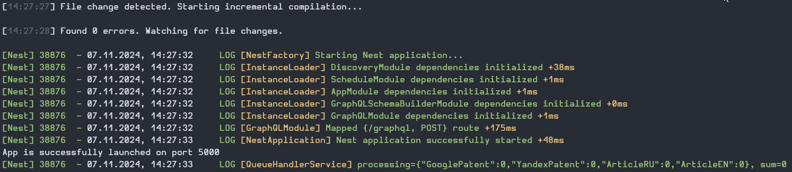
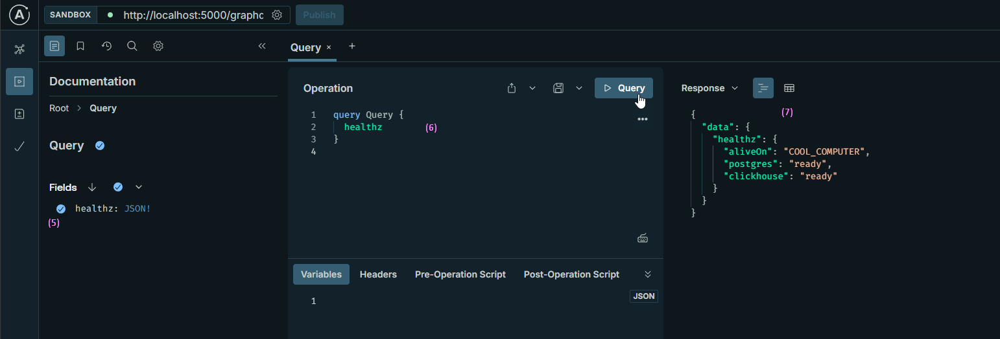
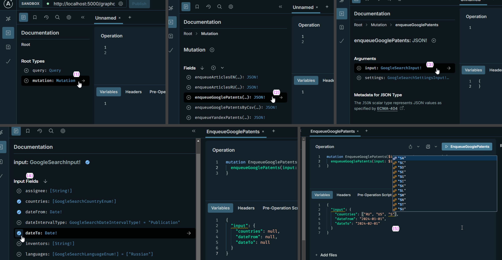
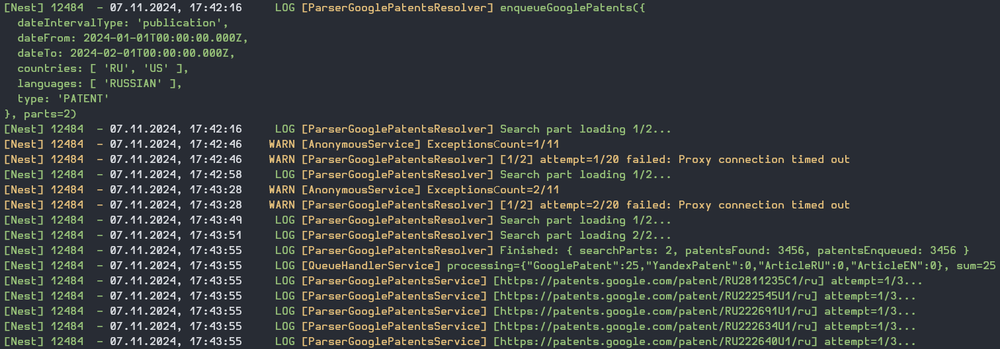
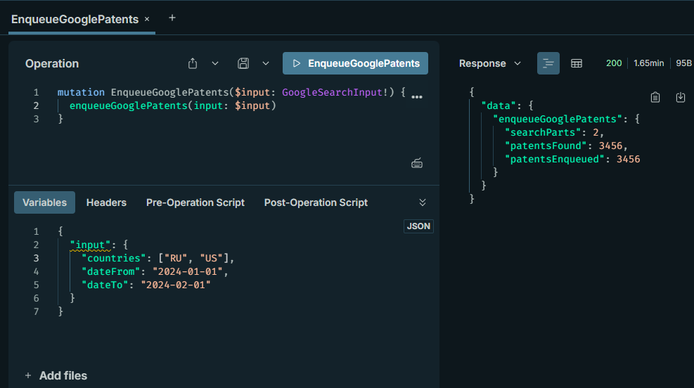
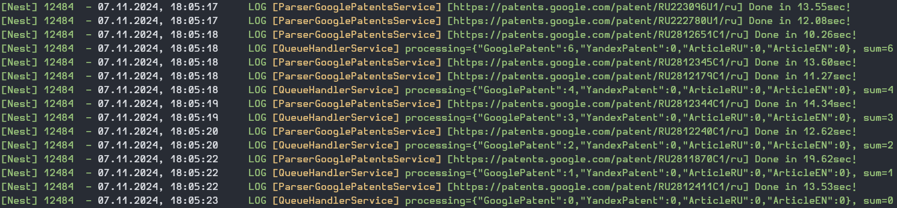
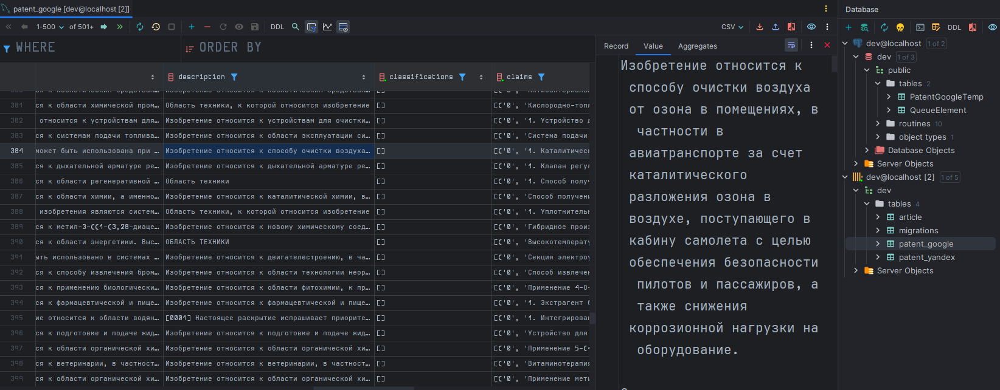

# Парсер патентов и журнальных статей

## Содержание

- [Описание](#Описание)
- [Эффективность и отказоустойчивость](#Эффективность-и-отказоустойчивость)
- [Стек технологий](#Стек-технологий)
- [Запуск и проверка готовности](#Запуск-и-проверка-готовности)
- [Пример парсинга Google патентов](#Пример-парсинга-google-патентов)

## Описание

Приложение для сбора в ClickHouse информации о патентах и публикациях с ресурсов:

- [Google Patents](https://patents.google.com/) - Патенты со всего мира.
- [Yandex Patents](https://yandex.ru/patents) - Патенты РФ и СССР.
- [Журнальный портал ФТИ им. А.Ф. Иоффе](https://journals.ioffe.ru) - Русскоязычные статьи.
- [JOURNAL OF ADVANCES IN PHYSICS](https://rajpub.com/index.php/jap/index) - Англоязычные статьи.

## Эффективность и отказоустойчивость

Приложение:

* Использует очередь задач через БД и pessimistic locking с пропуском уже заблокированных записей<span style="color:gray">, что позволяет распараллеливать парсинг вертикально и горизонтально</span>.

* Масштабируется горизонтально: Может быть запущено во множестве реплик<span style="color:gray">, например, в кластере [Kubernetes](https://kubernetes.io) или [Docker Swarm](https://docs.docker.com/engine/swarm)</span>.

* Масштабируется вертикально: Параллельная обработка нескольких задач в каждой из реплик.

* Продолжает работу при ошибке соединения/парсинге патента<span style="color:gray">, а патент с ошибкой будет повторно обработан через определенный промежуток времени</span>.

* Использует пул SOCKS5 Tor Proxy для избежания блокировок IP адреса<span style="color:gray">, а так же автоматически запрашивает новые proxy через определенный промежуток времени и при достижении лимита отказов</span>.

## Стек технологий

- Основное
  * [NodeJS](https://nodejs.org) - кроссплатформенная среда выполнения JavaScript с открытым исходным кодом.
  * [Docker](https://www.docker.com) - Контейнеризация приложения.
  * [PostgreSQL](https://www.postgresql.org) - Свободная объектно-реляционная СУБД. Используется для управления очередью парсинга.
  * [ClickHouse](https://clickhouse.com) - Колоночная СУБД для аналитических данных. Используется для хранения данных о патентах и статьях.
  * [tor-privoxy](https://github.com/dockage/tor-privoxy) - Docker Образ с Tor proxy.
- Дополнительно
  * [TypeScript](https://www.typescriptlang.org) - Расширение JavaScript, добавляющее типизацию в язык.
  * [NestJS](https://nestjs.com) - Фреймворк для создания эффективных, надежных и масштабируемых серверных приложений на JS/TS.
  * [GraphQL](https://graphql.org) - язык и описание API.
  * [Prisma](https://www.prisma.io) - ORM для NodeJS.
  * [@clickhouse/client](https://clickhouse.com/docs/en/integrations/language-clients/javascript) - ClickHouse клиент.
  * [Puppeteer](https://pptr.dev) - автоматизации Chrome/Chromium для взаимодействия с веб-сайтами.
  * [Axios](https://www.npmjs.com/package/axios) - HTTP-клиент.

## Запуск и проверка готовности

Требования:
- [NodeJS](https://nodejs.org)
- [Docker](https://www.docker.com)
- Сетевой провайдер с доступом к TorProxy или VPN

> [!IMPORTANT]
> Парсер анонимизирует свои запросы к целевым ресурсам при помощи TorProxy, посредством чего программа маскируется под множеством IP адресов и избегает попадания в черный список / ошибки 429 Too Many Requests, но данный сервис заблокирован на территории РФ. Для корректной работы необходимо использовать VPN с зарубежным сервером и широкой пропускной способностью или другой способ доступа к TorProxy, иначе вместо результата парсер будет бесконечно выдавать ошибку `Proxy connection timed out` или `Connection refused`.

```bash
# Установка зависимостей
npm install
npx puppeteer browsers install chrome
# Запуск БД и необходимых сервисов
npm run svc:dev:up
# Создание схем - миграции БД: PostgreSQL & ClickHouse
npx prisma db push
npm run clickhouse:migrate
# Запуск приложения в режиме разработки
npm run start:dev
```

> [!TIP]
> Установка зависимостей и применение миграций требуются лишь один раз, но обязательно сразу после клонирования или каждого обновления репозитория. При повторном запуске парсера, если репозиторий не был обновлён, достаточно лишь в интерфейсе Docker Desktop убедиться в готовности БД и после запускать парсер.

Успешный запуск парсера:



После запуска в браузере нужно открыть графический GraphQL клиент [Apollo Sandbox](https://studio.apollographql.com/sandbox/explorer):

<div align="center">
 
</div>

1. В левом верхнем углу указать адрес парсера `http://localhost:PORT/graphql` - вместо `PORT` прописать порт, указанный в терминале с запущенным парсером (по умолчанию используется `5000`).
2. В случае успешного соединения рядом с адресом появится 🟢 зеленый кружок.
3. Далее можно осмотреть документацию API, предоставляемого парсером, во вкладке `Documentation`.

> [!NOTE]
> В GraphQL существуют 2 основных типа запросов: `query` и `mutation`.
> Первый используется для получения данных, второй - для изменения.
> Для ознакомления с GraphQL рекомендуется обратиться к [Learn GraphQL](https://graphql.org/learn), но используемый в текущей инструкции клиент Apollo Sandbox предоставляет интерфейс для использования API без необходимости писать запросы вручную.

4. Для проверки готовности парсера и его соединения с БД можно выполнить запрос `healthz`, находящийся в `Query` запросах. Откройте вкладку `Query`.



5. Оказавшись в `Query` запросах, в левой части интерфейса активируйте галочку рядом с запросом `healthz`.
6. В разделе `Operation` посередине экрана Apollo Sandbox напишет за нас необходимую GraphQL инструкцию. Нажмите кнопку `▶ Query` для её выполнения.
7. В случае успешной проверки готовности в правой части экрана отобразится ответ от парсера, включающий имя хоста, на котором запущен парсер, и статус соединения с Postgres и ClickHouse.

## Пример парсинга Google патентов

> [!IMPORTANT]
> Перед началом необходимо выполнить инструкции из предыдущего раздела `Запуск и проверка готовности`, где также описано как начать пользоваться [Apollo Sandbox](https://studio.apollographql.com/sandbox/explorer). Это необязательно делать полностью каждый раз, но парсер должен быть готов к работе.



1. В левой части интерфейса откройте вкладку `Mutations` в [Apollo Sandbox](https://studio.apollographql.com/sandbox/explorer).
2. Перейдите к запросу `enqueueGooglePatents`.
3. У этого запроса есть несколько аргументов, освновной из которых `input`. Откройте его.
4. В данном запросе содержимое аргумента `input` соответствует параметрам интерфейса [расширенного поиска Google Patents](https://patents.google.com/advanced), но в формате JSON. Выберите интересующие вас параметры и они появятся в средней нижней части интерфейса `Variables`.
5. Измените значения параметров на необходимые и нажмите кнопку `▶ EnqueueGooglePatents`.

В терминале парсер проинформирует о том, что он начал поиск патентов. Неудавшиеся попытки будут повторяться через небольшой промежуток времени. Сразу после успешного поиска начнётся парсинг найденных патентов:



В интерфейсе Apollo Sandbox будет виден результат поиска, включающий количество найденных патентов и количество из них добавленных в очередь на парсинг, за исключением тех, что уже полностью обработаны и есть в БД:

<div align="center">
 
</div>

Проверяя терминал с запущенным парсером спустя время после начала парсинга, можно увидеть, сколько патентов сейчас парсится в строке `processing{...}, sum=...`, как только `sum` окажется равной `0`, значит парсинг завершён и приложение простаивает, ожидая нового поиска:



> [!TIP]
> Вы можете выполнить несколько запросов поиска подряд, не дожидаясь окончания парсинга результатов предыдущего поиска. Парсер будет обрабатывать патенты из очереди в порядке их поступления.

> [!TIP]
> Во время выполнении запроса поиска важно не прерывать работу парсера, иначе результаты не будут добавлены в очередь на парсинг.
> После окончания поиска, вы можете завершать работу парсера в любой момент, нисмотря на активный парсинг элементов очереди, а после повтороного запуска программа продолжит обработку очереди при наличии в ней ссылок на патенты/статьи.

Результаты парсинга будут доступны в ClickHouse и могут быть просмотрены через любой [инструмент для работы с ClickHouse](https://clickhouse.com/docs/ru/interfaces) и [библиотеки клиента для разных языков программирования](https://clickhouse.com/docs/ru/interfaces/third-party/client-libraries). Например, в плагине `Database Tools and SQL` для одной из JetBrains IDE:



